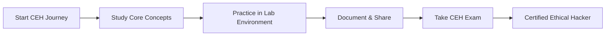

# 🔐 CEH Security Labs

> Documenting my journey through Certified Ethical Hacker (CEH) certification with practical labs, tools, and ethical hacking techniques.

[](https://github.com/ROHITHD300900/CEH-Security-Labs/stargazers)
[](https://github.com/ROHITHD300900/CEH-Security-Labs/network/members)

---

## 📚 About This Repository

This repository contains hands-on security labs, tools, scripts, and notes from my CEH certification preparation. All content is created for **educational purposes** and follows **ethical hacking guidelines**.

## 🎯 What You'll Find Here

### 📖 Study Notes
- Core concepts and methodologies
- Security best practices
- Key terms and definitions
- Exam preparation tips

### 🛠️ Practical Tools & Scripts
- Python security automation scripts
- Network scanning tools
- Vulnerability assessment utilities
- Penetration testing frameworks

### 🧪 Lab Exercises
- Step-by-step security labs
- Real-world scenarios
- Capture The Flag (CTF) challenges
- Practice environments

### 📝 Documentation
- Tool usage guides
- Setup instructions
- Best practices and workflows

---

## 🚀 Getting Started

### Prerequisites
```bash
# Basic requirements
- Python 3.8+
- Virtual machine (VirtualBox/VMware)
- Kali Linux or similar pentesting OS
- Basic networking knowledge
```

### Installation
```bash
# Clone this repository
git clone https://github.com/ROHITHD300900/CEH-Security-Labs.git

# Navigate to project directory
cd CEH-Security-Labs

# Install dependencies (if applicable)
pip install -r requirements.txt
```

---

## 📂 Repository Structure

```
CEH-Security-Labs/
├── notes/              # Study notes and concepts
├── scripts/            # Python security scripts
├── labs/               # Hands-on lab exercises
├── tools/              # Security tools and utilities
├── resources/          # Additional learning resources
└── README.md           # You are here!
```

---

## 🔍 Key Topics Covered

<table>
<tr>
<td width="50%">

### Reconnaissance
- Footprinting and information gathering
- Scanning networks
- Enumeration techniques

### System Hacking
- Password cracking
- Escalating privileges
- Maintaining access

### Network Security
- Sniffing and spoofing
- Denial of Service (DoS)
- Session hijacking

</td>
<td width="50%">

### Web Application Security
- SQL Injection
- Cross-Site Scripting (XSS)
- Web server attacks

### Wireless Security
- WiFi encryption attacks
- Wireless network analysis
- Bluetooth attacks

### Cryptography
- Encryption algorithms
- Hashing and digital signatures
- Public Key Infrastructure (PKI)

</td>
</tr>
</table>

---

## ⚠️ Legal Disclaimer

**IMPORTANT**: All tools, techniques, and scripts in this repository are for **educational purposes only**. 

- ✅ Use only on systems you own or have explicit permission to test
- ✅ Follow all applicable laws and regulations
- ✅ Practice ethical hacking principles
- ❌ Never use for unauthorized access or malicious purposes

**Unauthorized access to computer systems is illegal and punishable by law.**

---

## 🎓 Learning Path



---

## 🤝 Contributing

While this is primarily a personal learning repository, suggestions and improvements are welcome!

1. Fork the repository
2. Create your feature branch (`git checkout -b feature/improvement`)
3. Commit your changes (`git commit -m 'Add some improvement'`)
4. Push to the branch (`git push origin feature/improvement`)
5. Open a Pull Request

---

## 📞 Connect With Me

- 💼 **LinkedIn**: [Rohith D](https://www.linkedin.com/in/rohith-d-a46aaa288/)
- 📧 **Email**: rohithd300900@gmail.com
- 🐙 **GitHub**: [@ROHITHD300900](https://github.com/ROHITHD300900)

---

## 📖 Resources & References

- [EC-Council CEH Official](https://www.eccouncil.org/programs/certified-ethical-hacker-ceh/)
- [OWASP Top 10](https://owasp.org/www-project-top-ten/)
- [Hack The Box](https://www.hackthebox.com/)
- [TryHackMe](https://tryhackme.com/)

---

## 📈 Progress Tracker

- [x] Repository Setup
- [x] Initial Documentation
- [ ] Reconnaissance Labs
- [ ] Scanning & Enumeration Labs
- [ ] System Hacking Labs
- [ ] Web Application Security Labs
- [ ] Wireless Security Labs
- [ ] Complete CEH Certification

---

<div align="center">

### ⭐ If you find this repository helpful, please give it a star!

**Learning to hack ethically, one lab at a time.** 🚀


</div>

---

**Last Updated**: November 2025
**Status**: 🟢 Active Learning
